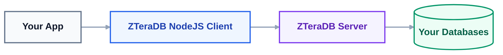

# 📦 Node.js Client

Welcome to the official ZTeraDB Node.js Client documentation. This package implements a performance-optimized, ZQL-first database driver utilizing a raw TCP socket transport layer.

---

## 📘 What Is ZTeraDB?

ZTeraDB allows you to connect to your existing databases (PostgreSQL, MySQL, MSSQL, etc.) through a single, unified platform using **One Unified Query Language (ZQL)**.

## Technical Overview
This package implements a performance-optimized, ZQL-first Node.js client utilizing a raw TCP socket transport layer.

To ensure low-overhead binary framing, the client communicates with the ZTeraDB server using **4-byte big-endian length-prefixed payloads** containing structured JSON data. This underlying transport architecture eliminates HTTP overhead, offering high-throughput query execution directly from your Node.js runtime.

---

## 🧠 Architecture Overview

You never connect to your backend databases directly. ZTeraDB handles all connections, cryptographic signing, proxy routing, and query execution securely behind the scenes.



---

## ⭐ Key Features

*   🚀 **Unified Query Language (ZQL):** Write once, run on any database.
*   🔌 **Easy Integration:** Seamlessly plugs into any Node.js application.
*   ⚙️ **Auto-Managed Connections:** Handles connection pooling and automatic retries.
*   🔐 **Secure Authentication:** Protected via client, access, and secret keys.
*   🎯 **Clean Query Builder:** Fluent interface for standard CRUD operations (`insert`, `select`, `update`, `delete`).
*   🔍 **Advanced Filtering:** Built-in support for complex logical and mathematical filters.
*   🧵 **Streamed Results:** Efficiently memory-manages large datasets using Node.js generators.
*   📦 **Modern Ecosystem:** Composer-ready and fully compatible with frameworks like Laravel, Symfony, and CodeIgniter.

---

## 🛠 Prerequisites & Requirements

| Requirement | Specification |
| :--- | :--- |
| **Node.js Version** | Node.js 18.20.7 or higher (Download from [nodejs.org](https://nodejs.org)) |
| **Knowledge Base** | Familiarity with asynchronous JavaScript (Promises / Async-Await) |
| **Credentials** | ZTeraDB account with active clientKeys |

---

## Installation

### Option 1: Via npm (Recommended)
Run the following command in your terminal to install the ZTeraDB client:

```sh
npm install @zteradb/client
```

### Option 2: Via Yarn
Alternatively, you can pull the package using yarn:

```bash
yarn add @zteradb/client
```

---

## 🧪 Running Tests
To verify that your installation is working correctly and the client can communicate with your environment, you can run the test suite.

1. Configure Environment Variables
Create a `.env` file in your root directory (or export them to your environment):

```bash
ZTERADB_HOST=localhost
ZTERADB_PORT=7777
ZTERADB_CONFIG=your_config_string_here
```

2. Run the Test Scripts
Execute the test suite using your preferred package manager:

```javascript
# Using npm
npm test

# Using yarn
yarn test
```

---

# 🚀 60-Second Quick Start

```javascript
import { ZTeraDBConnect, ZTeraDBQuery, ZTeradbConfig } from "zteradb/client"; // Or using commonJS: const { ZTeraDBConnect, ZTeraDBQuery, ZTeradbConfig } = require('zteradb/client');

// 1. Setup Configuration
const config = ZTeradbConfig(process.env.ZTERADB_CONFIG);

// 2. Initialize Connection
const db = ZTeraDBConnect(
  config,
  "<Your ZTeraDB HOST>",
  7777
);

// 3. Build ZQL Query
const query = new ZTeraDBQuery("user").select();

// 4. Execute and Stream Results
const users = await db.run(query);

for await (const row of users) {
  console.log(row);
}

// 5. Close Connection
db.close();
```

---

## 🗂 Documentation Sections

Explore the rest of our guides to unlock the full potential of ZTeraDB:

*   🔐 [Configuration](./docs/config) — Learn all available configuration options.
*   🔌 [Connection](./docs/zteradb-connection) — Deep dive into socket connections and lifecycle management.
*   🔍 [Query Builder](./docs/zteradb-query) — Master building fluent ZQL queries.
*   🎛️ [Filter Conditions](./docs/filter-condition) — Apply advanced math and logical filters to your data.
*   🍳[Examples](./docs/query-examples) — Copy-pasteable snippets for common use cases.
*   🛠 [Troubleshooting Guide](./docs/troubleshooting) — How to resolve common connection or runtime errors.
*   🚀 [Quickstart Guide](./docs/quickstart) — A streamlined, 5-minute setup guide.
*   🥇 [Licence](./LICENCE) — Open-source licence terms.

---

## **Licence**

This project is licenced under the **ZTeraDB** Licence - see [LICENCE](./LICENCE) file for details.
