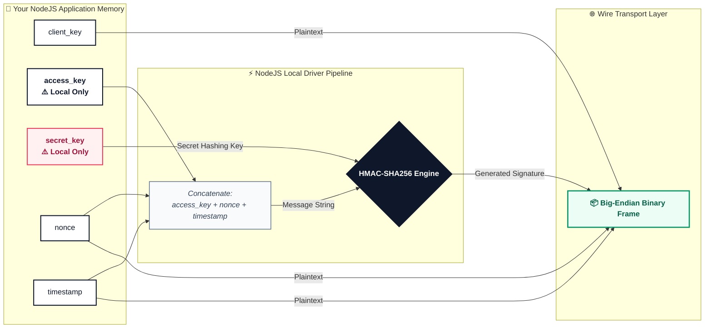
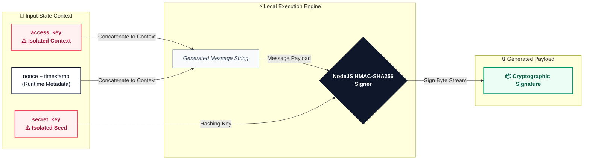

# 🔐 Configuration

This guide explains how to properly structure authentication parameters, cryptographic signing credentials, and operational pooling layers using the type-safe `ZTeraDBConfig` engine interface.


## 🛡️ The Three-Key Authentication Protocol

To protect high-throughput binary frames passing over low-overhead socket connections, ZTeraDB utilizes a decoupled signature verification matrix that inherently prevents network replay attacks.



---

## 🔒 Cryptographic Replay-Protection Pipeline
Your `accessKey` and `secretKey` is never exposed to the network. Instead, every time a query is evaluated through the connection layer, the driver automatically handles a local **HMAC-SHA256 signature sequence**:



1. **Message Synthesis:** The driver links your readable `access_key`, a cryptographically secure random `nonce` (number used once), and a current Unix `timestamp`.
2. **Signature Calculation:** The local runtime hashes that message using your hidden `secret_key` as the HMAC cryptographic key.
3. **Payload Packaging:** The calculated signature, nonce, and timestamp are packed directly into the binary frame header. The server replicates this exact math using its vault copy of your secret key to guarantee the payload has not been modified or replayed.

    > ⚠️ **System Time Dependency:** Because signatures use timestamps, your application server's clock must be highly accurate. If your clock drifts by more than 5 minutes, the server will automatically reject transactions.

---

## 🧩 Complete Structure Overview
Here is the entire configuration matrix with its nested schemas. The factory naturally accepts standard JavaScript objects:

```javascript
import { ZTeraDBConfig } from '@zteradb/client'; // Or using commonJS: const { ZTeraDBQuery } = require('zteradb/client');

const config = ZTeraDBConfig({
  clientKey: 'string',
  accessKey: 'string',
  secretKey: 'string',
  databaseID: 'string',
  env: 'dev' | 'staging' | 'qa' | 'prod', // Accessible via ENVS constant properties
  responseDataType: 'json',
  use_tls: true | false,
  verify_tls_host: true | false,
  options: {
    connectionPool: {
      min: 0,
      max: 1
    }
  }
});
```

---

## ⚙️ Advanced Properties Reference

### 1. Authentication & Core Identity

| Parameter | Type | Exposure | Operational Responsibility |
| :--- | :--- | :--- | :--- |
| `client_key` | `string` | Public | **Required.** Your unique ZTeraDB user account identity string. Found in your **Dashboard -> User Profile → Security Credentials**. |
| `access_key` | `string` | Private | **Required. Never transmit over the wire.** A token used locally by the Node.js runtime, combined with a nonce and timestamp, to generate or verify an HMAC payload |
| `secret_key` | `string` | **Secret** | **Required. Never transmit over the wire.** Used locally by the Node.js runtime to execute an HMAC integrity checksum on raw payloads. |
| `database_id` | `string` | Private | **Required.** The static unique string pointing to your isolated target database cluster instance. |

> 🔒 **Security Best Practice:** Never hardcode your `access_key` and `secret_key` into your codebase or commit configurations to version control. Always extract parameters dynamically at runtime using secure environment variables.

---

### 2. Environment & Serialization

The `env` and `response_data_type` settings route your application's connection layer to the correct backend infrastructure cluster and dictate how data is unpacked in memory.


* **`env`** *(Allowed Values: `ENVS::DEV` \| `ENVS::STAGING` \| `ENVS::QA` \| `ENVS::PROD`)*  
  Specifies the target environment block for the database driver. The configuration engine catches loose string inputs coming from system environments (e.g., `"PROD"`, `"STAGING"`) and automatically coaxes them into safe, lowercase matches.  
  * *Fallback:* `process.env.ZTERADB_ENV` (Defaults cleanly to `ENVS::DEV` if completely absent).

* **`response_data_type`** *(Allowed Values: `ResponseDataTypes::JSON`)*  
  Informs the lower transport framing engine how to parse and deserialize incoming un-prefixed buffer stream payloads into runtime memory structures. Currently, the client defaults exclusively to type-safe JSON object serialization via class constants.

---

### 3. Transport Layer Security (TLS)

| Parameter | Type | Default | Description |
| :--- | :--- | :--- | :--- |
| `use_tls` | `bool` | `false` | Upgrades the raw TCP transport stream to an encrypted TLS socket connection.<br/>*Fallback:* `process.env.USE_TLS` |
| `verify_tls_host` | `bool` | `true` | When TLS is enabled, this checks that the server's certificate matches the target hostname. Toggle to `false` **only** during development if testing with self-signed local certificates.<br/>*Fallback:* `process.env.VERIFY_TLS_HOST` |

---

### 4. Performance Tuning (`options.connectionPool`)

For traffic-heavy apps, pass an `Options` object holding a `ConnectionPool` config to configure socket reuse rules.

```javascript
options: {
  connectionPool: {
    min: 2,
    max: 10
  }
}
```

| Field | Meaning |
|-------|---------|
| `min` | Minimum persistent connections ZTeraDB keeps open |
| `max` | Maximum number of allowed connections |

* Note: If this configuration is omitted, ZTeraDB automatically provisions and scales connections dynamically based on traffic spikes.

---

## 🧪 Comprehensive Implementation Example
### Option A: Clean Implicit Environment Ingestion (Recommended)
If your operating platform exposes variables using matching system keys, the engine can build and validate configurations implicitly without passing hardcoded parameters:


```javascript
import { ZTeraDBConfig, ENVS, ResponseDataTypes } from "zteradb/client"; // Or using commonJS: const { ZTeraDBQuery } = require('zteradb/client');

const config = ZTeraDBConfig({
  // Direct explicit passing (or handled automatically via process.env fallback)
  clientKey: process.env.ZTERADB_CLIENT_KEY,
  accessKey: process.env.ZTERADB_ACCESS_KEY,
  secretKey: process.env.ZTERADB_SECRET_KEY,
  databaseID: process.env.ZTERADB_DATABASE_ID,
  
  // Core Engine Handlers
  env: ENVS.PROD,
  responseDataType: ResponseDataTypes.JSON,
  
  // Socket Encryption Layers
  use_tls: true,
  verify_tls_host: true,
  
  // Custom Resource Allocation Limits
  options: {
    connectionPool: {
      min: 5,
      max: 25
    }
  }
});

// The final configuration payload is structured and permanently frozen 
export default config;
```

---

## ⚠️ Common Anti-Patterns to Avoid

* ❌ **Hardcoding and Committing Secrets:** Writing sensitive credentials directly into script configurations or accidentally pushing them to version control repositories (e.g., GitHub).
  * *Fix:* Inject keys dynamically via system environment variables. The initialization pipeline automatically resolves missing parameters using secure `process.env` cascading fallbacks at runtime.

* ❌ **Attempting Runtime Configuration Mutations:** Trying to alter, append, or delete properties on the generated configuration object within downstream application middleware steps.
  * *Fix:* Treat the returned payload as strictly immutable. The factory engine enforces runtime state integrity by deeply executing `Object.freeze()` across three critical layer boundaries (`finalConfig`, `options`, and `connectionPool`).

* ❌ **Improper Connection Pool Boundaries:** Supplying invalid numeric relationships for resource allocation, such as setting the minimum connection threshold higher than the maximum limit (`min > max`).
  * *Fix:* Ensure logical boundary constraints are met. The parsing sub-module uses strict base-10 radix verification and aggregates discrepancies into a central validation array, triggering a runtime exception if boundaries are breached.

* ❌ **Passing Arbitrary or Un-Validated Environment Strings:** Typing raw, arbitrary string words (like `"production"`, `"local"`, or `"testing"`) directly into the configuration block.
  * *Fix:* Supply one of the whitelisted deployment targets: `"DEV"`, `"STAGING"`, `"QA"`, or `"PROD"`. For maximum type-safety and consistency, utilize the exported `ENVS` constant mapping flags (e.g., `ENVS.PROD`). The engine safely normalizes inputs internally.

* ❌ **Running Plaintext Connections in Production Environments:** Omitting the transport security flag or allowing it to fallback to `false` in live enterprise pipelines.
  * *Fix:* Explicitly toggle `use_tls: true` inside production environments to upgrade the transport stream to an encrypted socket connection and pass regulatory compliance constraints.

---

# 🎉 You are ready to create a connection!
Continue to:  
👉 **zteradb-connection.md**

