# 🔌 Connection

This guide explains how to establish, manage, and close connections to the ZTeraDB Server using the core `ZTeraDBConnection` client engine.

---

## 🔌 What is ZTeraDBConnection?

The `ZTeraDBConnection` class serves as the primary network broker for your application. It abstracts low-level socket management and handles:

* 🔐 **Secure Handshakes:** Opens and manages TCP/TLS streams directly to the server.
* 🎫 **Session Auth:** Handles initial token validations using your configuration keys.
* 🚀 **High-Throughput Streaming:** Executes ZQL payloads and delivers efficient buffer streams.
* 🔄 **Socket Reuse:** Integrates directly with client-side connection pooling layers.

---

## 🧠 Architectural Overview

ZTeraDB decouples your application from the underlying target systems by acting as a single database proxy router:

```mermaid
graph LR
    %% Primary Core Nodes
    App["Your NodeJS App"]
    Client["ZTeraDB Client"]
    Server["ZTeraDB Server"]
    DB["MySQL / PostgreSQL / MSSQL / ..."]

    %% Network / Protocol Intermediaries
    SOCKET["TCP Socket Layer<br />⚡ TLS Supported"]
    ROUTING["Multiplexed Routing<br />🔀 Load Balanced"]

    %% Pipeline Execution Flow
    App --> Client
    Client --> SOCKET --> Server
    Server --> ROUTING --> DB

    %% Component Styles (High Contrast, Bold Borders)
    style App fill:#ffffff,stroke:#0f172a,stroke-width:2.5px,color:#0f172a,font-weight:bold
    style Client fill:#eff6ff,stroke:#2563eb,stroke-width:2.5px,color:#1e40af,font-weight:bold
    style Server fill:#f5f3ff,stroke:#7c3aed,stroke-width:2.5px,color:#5b21b6,font-weight:bold
    style DB fill:#ecfdf5,stroke:#059669,stroke-width:2.5px,color:#065f46,font-weight:bold

    %% Protocol Styles (Sleek, De-emphasized Data-In-Transit Nodes)
    style SOCKET fill:#f8fafc,stroke:#e2e8f0,stroke-width:1px,color:#475569,font-style:italic
    style ROUTING fill:#f8fafc,stroke:#e2e8f0,stroke-width:1px,color:#475569,font-style:italic
```



---

## 📦 Initializing a Connection

The connection constructor accepts your target infrastructure endpoints along with your initialized configuration layout.

```javascript
import { ZTeraDBConnection, ZTeraDBConfig } from "zteradb/client"; // Or using commonJS: const { ZTeraDBConnection, ZTeraDBConfig } = require('zteradb/client');

const config = new ZTeraDBConfig(JSON.parse(process.env.ZTERADB_CONFIG));

// Signature format: ZTeraDBConnection(ZTeraDBConfig config, string host, int port)
const connection = new ZTeraDBConnection(
  config,                         // ZTeraDBConfig object
  "Your ZTeraDB HOST",            // Host
  "Your ZTeraDB PORT Number"      // Port
);
```

---

## 🔑 Constructor Parameters

| Parameter | Type | Required | Description |
| :--- | :--- | :--- | :--- |
| `host` | `string` | **Yes** | The remote endpoint or network IP address allocated to your cluster runtime. *(e.g., `Your ZTeraDB HOST`)* |
| `port` | `int` | **Yes** | The active TCP entry port assigned to your instance. Defaults universally to `Your ZTeraDB PORT`. |
| `config` | `ZTeraDBConfig` | **Yes** | An initialized, valid configuration matrix containing your authentication profile. |

---

## 🎛 Client Methods

### 1. `run(ZTeraDBQuery query): iterable`
Submits an abstracted ZQL query framework directly to the cluster infrastructure socket.

```javascript
const query = new ZTeraDBQuery('user').select();
const result = await db.run(query);
```

---

* **Memory Optimization:** This method yields an **iterable data stream**. Rows are parsed as they arrive over the wire rather than loading the entire payload block into memory at once. It is highly recommended to loop through datasets via `foreach()`.

### 2. `close(): void`
Closes active streaming connections and frees up network socket descriptors on the host device.

```javascript
await db->close();
```

---

> 💡 **Serverless Tip:** Always explicitly invoke `close()` at the conclusion of your script, especially inside ephemeral microservice architectures (like AWS Lambda or Bref) to prevent connection leaks.

---

## 🧪 Complete Implementation Blueprint

```javascript
// Import required classes
import { ZTeraDBConfig, ZTeraDBConnection, ZTeraDBQuery } from "zteradb/client"; // Or using commonJS: const { ZTeraDBConfig, ZTeraDBConnection, ZTeraDBQuery } = require('zteradb/client');

// Set configuration
const config = new ZTeraDBConfig(JSON.parse(process.env.ZTERADB_CONFIG));

// 
const db = new ZTeraDBConnection(config, "Your ZTeraDB HOST", "Your ZTeraDB Port number");

// Select all records from user schema
const query = new ZTeraDBQuery("user").select();

// Run and wait for the query response
const result = await db.run(query);

// Iterate the query result
for await (const row of result) {
  console.log(row);
}

// Close the ZTeraDB connection
await db.close();
```

---

## ⚠️ Troubleshooting Connection Failures

* ❌ **Socket Exception / Timeout Errors:** Usually points to incorrect network routing or network access controls blocking access.
  * *Fix:* Double-check your host endpoint address and make sure outbound connections on port `7777` are permitted by your firewall.

* ❌ **Authentication Rejections:** The client can reach the server but your security handshake fails.
  * *Fix:* Ensure all required keys (`client_key`, `access_key`, `secret_key`, and `database_id`) are mapped properly through your `.env` loader.

* ❌ **Resource Leakage Warning:** NodeJS warning notifications or high system socket metrics.
  * *Fix:* Wrap execution processes inside a structural `try...finally` block to make sure `db->close()` runs regardless of execution errors.

---

### 🎉 Next Step
Now that your connection pipeline is established, learn how to build complex data lookups:
👉 **[ZTeraDB Query Guide](./zteradb-query.md)**
