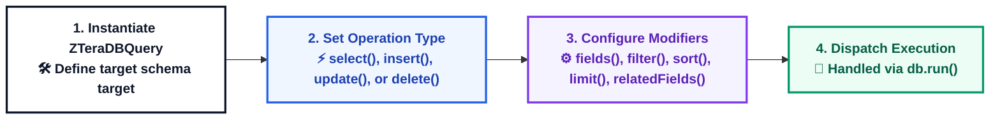

# 🔍 Query Builder

The `ZTeraDBQuery` class provides a type-safe, fluent, and chainable interface to build database operations across your entire infrastructure without writing raw SQL.

---

## 🎯 Core Capabilities

`ZTeraDBQuery` encapsulates standard CRUD actions and advanced data modification matrices into an abstracted object:

* **Unified Syntax:** Write queries once; execute seamlessly regardless of whether the target database is relational or document-oriented.
* **Filtering Strategies:** Apply both simple strict-equality filters and complex operational abstract syntax trees (ASTs).
* **Sorting Matrices:** Define index priority scan orders cleanly via directional weighting markers.
* **Pagination Control:** Restrict network payload weight sizes natively via structural offset limiting.
* **Related Field Lookups (Joins):** Perform effortless entity relation stitching by recursively scoping query parameters inside connected models.
* **Prevent Injection:** Parameters are structurally parsed to isolate execution logic from data inputs.

---

## 🧠 Query Lifecycle



---

## 🏗 Operations Matrix

| Operation | Method | Primary Purpose |
| :--- | :--- | :--- |
| **Read** | `.select()` | Retrieves records from the target collection/schema. |
| **Create** | `.insert()` | Appends new datasets or entries to the infrastructure layer. |
| **Update** | `.update()` | Modifies existing values based on matched criteria. |
| **Destroy** | `.delete()` | Purges target rows/documents from persistence layers. |

---

## 🕹 Initializing a Query Instance

Pass your targeted table or schema name directly to the class constructor block.

```javascript
const { ZTeraDBQuery } = require("zteradb/client"); // Or using ES modules: import { ZTeraDBQuery } from "zteradb/client";

const query = new ZTeraDBQuery("schemaName");
```

## 🏷 Executing Basic CRUD Operations

### 1. SELECT (with Field Projections)
```javascript
const query = new ZTeraDBQuery("user")
    .select()
    .fields({
        email: 1,
        status: 1
    });
```

### 2. INSERT
Always bind your input data state to the runtime context via fields() right after executing your creation hooks.

```javascript
const query = new ZTeraDBQuery("user")
    .insert()
    .fields({
        name: "John",
        email: "john@test.com",
        status: true
    });
```

### 3. UPDATE
Combines data mutations assigned through fields() alongside conditional filtering targets.

```javascript
const query = new ZTeraDBQuery("user")
    .update()
    .fields({ status: false })
    .filter({ id: 1 });
```

### 4. DELETE
Restricts target deletion records utilizing basic evaluation scope parameters.

```javascript
const query = new ZTeraDBQuery("user")
    .delete()
    .filter({ id: 5 });
```

---

## 🎯 Query Filtering Strategy
ZTeraDB supports two execution paths for evaluation constraints depending on query complexity.

### Basic Key-Value Matching (`filter`)
For deterministic equality evaluations (WHERE field = value), use the high-performance object layout.

```javascript
query.filter({ status: true });
query.filter({ id: 10 });
query.filter({ email: "abc@test.com" });
```

### Advanced AST Parsing (`filterConditions`)
For complex functional evaluations containing algebraic computations, multi-conditional clauses, or mathematical boundaries, use AST operation wrappers.

```javascript
// Compiles to: WHERE price * quantity = 200
query.filterConditions(
    ZTEQUAL(
        ZTMUL(["price", "quantity"]),
        200
    )
);
```

## 🔗 Related Fields Lookup (Joins)
Entity relationships can be fetched and stitched recursively by embedding isolated query builder pipelines into properties via `relatedFields()`.

```javascript
// 1. Establish the isolated scope constraint for the related entity
const userFilter = new ZTeraDBQuery("user")
    .select()
    .fields({ email: 1 })
    .filter({ status: true });

// 2. Map the relationship scope directly into the host query pipeline
const query = new ZTeraDBQuery("order")
    .select()
    .relatedFields({
        user: userFilter
    });
```

## 📚 Sorting, Pagination, & Aggregations
### Sorting Modifiers
Configure delivery sorting vectors using standard indexing weights: 1 for Ascending and -1 for Descending execution orders.

```javascript
query.sort({ price: 1 });   // Ascending (Low to High)
query.sort({ price: -1 });  // Descending (High to Low)
```

### Offset Pagination
Limit network payload memory sizes at runtime by requesting distinct chunk offsets via `limit(offset, count)`.

```javascript
query.limit(0, 10); // Fetches the first 10 matching records
```


### Count Aggregations
To return an integer indexing the total quantity of rows matching your parameters without retrieving heavy data payloads, call `count()`.

```javascript
query.count();
```


## 🧪 Comprehensive Blueprint Example

```javascript
const { ZTeraDBQuery } = require("zteradb/client");  // Or using ES modules: import { ZTeraDBQuery } from "zteradb/client";

const query = new ZTeraDBQuery("product")
    .select()
    .fields({
        name: 1, 
        price: 1
    })
    .filter({ status: "A" })
    .sort({ price: 1 })
    .limit(0, 20); // From the beginning, fetch the top 20 records
```

---

## ⚠️ Common Developer Anti-Patterns
* ❌ Over-using Complex Operations: Invoking filterConditions() for simple, strict equalities.
  * Fix: Default to .filter() for strict key-value pairs to leverage internal driver parsing optimizations.
* ❌ Skipping Input Payload Mappings: Forgetting to pass object attributes via .fields() during creation or patch cycles.
  * Fix: The driver throws runtime exceptions if data mutation states are missing during an insert() or update().
* ❌ Invalid Sort Directions: Passing arbitrary string evaluation characters like "ASC", "DESC", or an un-indexed boundary step like 0.
  * Fix: Strictly utilize 1 or -1 for direction control.
* ❌ Instantiating Without Schema Identifiers: Attempting to build an orphan configuration without giving the constructor a target database schema.
  * Fix: Always pass a valid schema name into the new ZTeraDBQuery() invocation sequence.

---

### 🎉 Next Step
Dive deep into creating relational conditions, nested logic expressions, and advanced query operators:  
👉 **[Filter Condition Guide](./filter-condition.md)**
